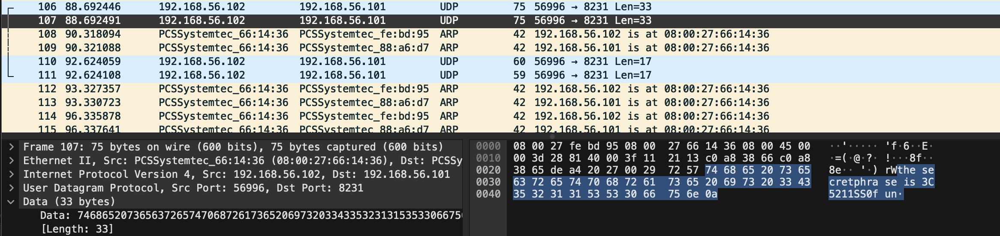

# Network Challenge 1: Secret on the wire

For this challenge, I was presented with a .pcap file that contained a hidden flag somewhere within the network traffic. To find this flag, I used Wireshark to analyze the capture file, focusing specifically on UDP packets.

I systematically searched through the traffic using Wireshark's search functionality, looking for common keywords like "secret", "password", and "flag". This methodical approach proved successful as I was able to locate the packet containing the flag:

## Key Insights
- Network analysis tools like Wireshark are essential for efficient packet inspection
- Understanding packet structures enables strategic and targeted searching
- Systematic approach to packet analysis leads to quicker problem resolution